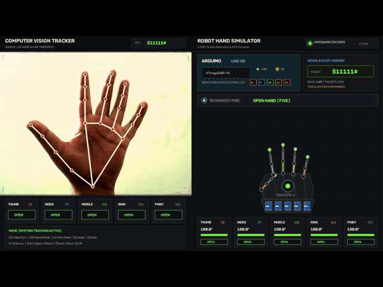
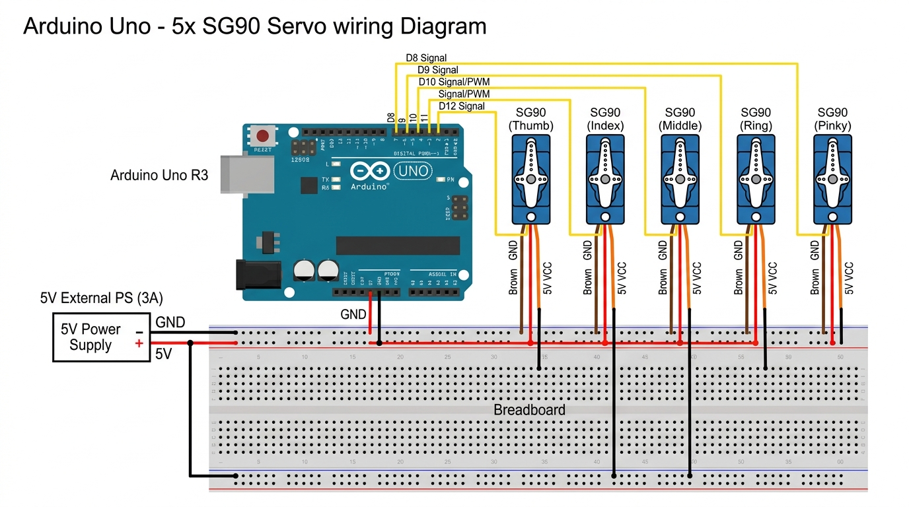

# Robot Hand Gesture Controlled

Real-time hand gesture tracking and 5-DOF robotic hand control via Arduino.

[](https://python.org)
[](https://opencv.org)
[](https://mediapipe.dev)
[](https://arduino.cc)
[](LICENSE)

A computer vision and robotics project that tracks hand gestures in real time using MediaPipe and OpenCV, translates them into 5-DOF servo commands, and transmits serial packets to an Arduino Uno. It includes a built-in virtual Arduino and robot hand simulator, allowing complete testing without physical hardware.

## Demo

<p align="center">
  
</p>

## Features

- **Virtual Simulator**: Built-in visual simulator modeling Arduino Uno serial communication and 5-DOF servo motion with live telemetry.
- **Webcam and Video Fallback**: Automatic webcam detection with seamless fallback to bundled demo footage. Switch between live camera and video during runtime with `S`.
- **Hand Gesture Tracking**: Real-time left and right hand tracking using MediaPipe landmark detection (Fist, Peace, Thumbs Up, Rock On, Spider-Man, OK sign, and more).
- **Manual Keyboard Control**: Manipulate individual fingers with keys `1` through `5` or trigger preset poses.
- **Audio Feedback**: Optional sound effects for servo actuation and gesture triggers (toggle with `A`).
- **Firmware Compilation**: Includes `compile_arduino.py` to build production `.hex` firmware using `arduino-cli`.
- **Wokwi Integration**: Circuit simulation files included for testing directly in the browser.

## Getting Started

### Installation

Clone the repository and install dependencies:

```bash
pip install -r requirements.txt
```

Or using `uv`:

```bash
uv pip install -r requirements.txt
```

### Running the Application

```bash
# Auto-detect webcam (falls back to demo video if unavailable)
python main.py

# Force webcam (default index 0)
python main.py --webcam

# Select a specific camera index
python main.py --webcam 1

# Run with a video file (loops by default)
python main.py --video assets/videos/demo_vid.mp4

# Run video without looping
python main.py --video assets/videos/demo_vid.mp4 --no-loop
```

> **Note:** On Windows, ensure no other applications (Teams, Zoom, OBS, browser) are actively accessing the webcam.

### Compiling Arduino Firmware (Optional)

To compile the firmware to `.hex` without the Arduino IDE GUI:

```bash
python compile_arduino.py
```

## Keyboard Controls

| Key | Action |
|:---:|:---|
| `S` | Toggle video source (Webcam / Demo video) |
| `M` | Toggle manual keyboard control mode |
| `V` | Cycle view (Dual / Simulator / Camera) |
| `A` | Toggle audio feedback |
| `1`–`5` | Toggle individual fingers (Thumb to Pinky) |
| `F` | Fist (`$00000#`) |
| `O` | Open Palm (`$11111#`) |
| `P` | Peace (`$01100#`) |
| `T` | Thumbs Up (`$10000#`) |
| `R` | Rock On (`$01001#`) |
| `K` | OK Sign (`$00111#`) |
| `Q` | Quit |

## Project Structure

```
.
├── main.py                  # CLI entry point and setup
├── compile_arduino.py       # Arduino-cli compile and upload script
├── gesture_presets.json     # Gesture definitions and servo mappings
├── requirements.txt         # Python dependencies
│
├── src/
│   ├── hand_tracking.py     # Hand detection using MediaPipe (with OpenCV fallback)
│   ├── arduino_simulator.py # Virtual Arduino and robotic hand visualizer
│   └── robot_hand_control.py# Main application loop, serial dispatch, and HUD
│
├── arduino/
│   ├── RobotHandArduino/
│   │   ├── RobotHandArduino.ino          # Arduino firmware (9600 baud, pins 8-12)
│   │   └── build/arduino.avr.uno/        # Compiled .hex / .elf binaries
│   └── simulation/
│       ├── diagram.json     # Wokwi circuit layout
│       ├── sketch.ino       # Firmware copy for Wokwi
│       └── wokwi.toml       # Wokwi configuration file
│
├── models/
│   └── hand_landmarker.task # MediaPipe hand landmark model
│
└── assets/
    ├── audio/               # Sound effects (.wav)
    ├── gif/                 # Demo animations
    └── images/              # Wiring diagram and documentation assets
```

## Hardware Setup

If connecting to a physical Arduino Uno:

| Servo | Arduino Pin |
|:---|:---:|
| Thumb | `D8` |
| Index | `D9` |
| Middle | `D10` |
| Ring | `D11` |
| Pinky | `D12` |

- **Power**: External 5V (2–3A) power supply connected to the servo power rails. Connect external supply ground to the Arduino GND.
- **Serial Protocol**: 9600 baud, packet format `$[T][I][M][R][P]#` where `1` = open (180°) and `0` = closed (0°).
- **Example**: `$11000#` opens the thumb and index finger while closing the others.

<p align="center">
  
</p>

## Wokwi Simulation

To test the circuit online:

1. Open the [Wokwi Arduino Uno Simulator](https://wokwi.com/projects/new/arduino-uno).
2. Paste the contents of `arduino/simulation/diagram.json` into the `diagram.json` tab.
3. Paste `arduino/simulation/sketch.ino` into the code editor.
4. Click **Start Simulation** and send test commands (such as `$11111#` or `$00000#`) in the Serial Monitor.

## License

This repository is licensed under the **MIT License**. See the [`LICENSE`](LICENSE) file for complete details.

---

## Connect with Me

<div align="center">

[](https://mohdfaizy.vercel.app)
[](https://www.linkedin.com/in/mohd-faizy/)
[](https://github.com/mohd-faizy)
[](https://www.credly.com/users/mohd-faizy)
[](https://twitter.com/F4izy)
[](https://ai.stackexchange.com/users/36737/faizy)
</div>